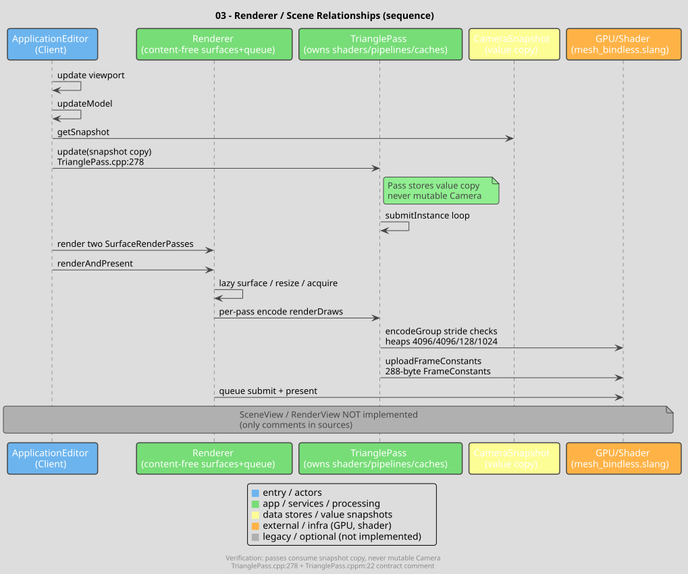
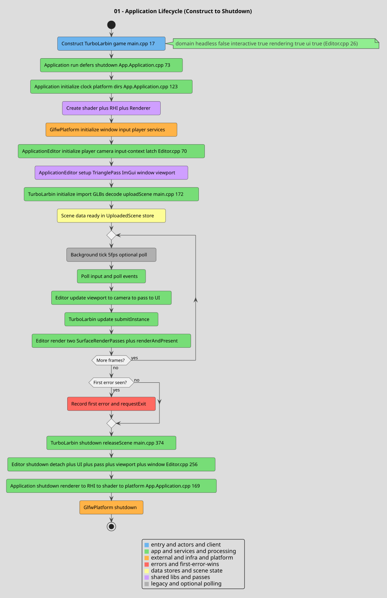
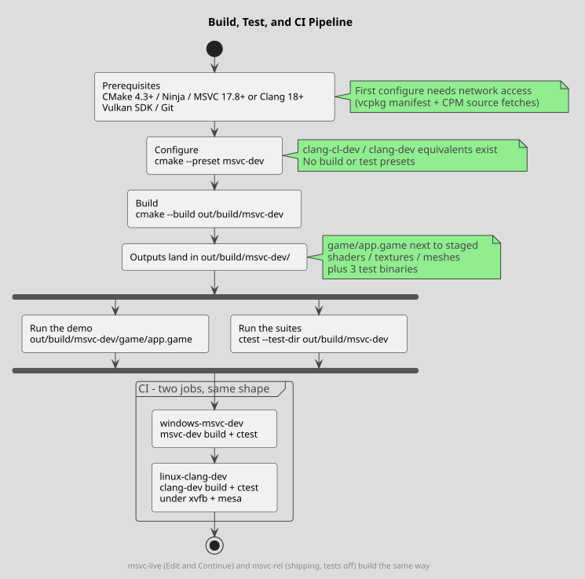
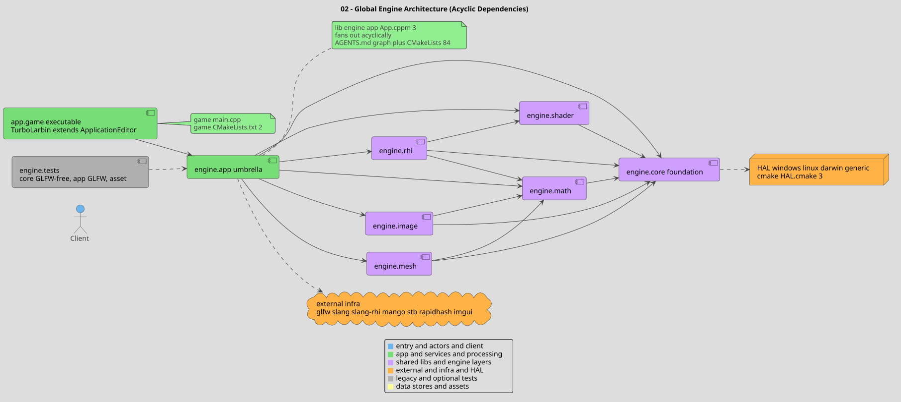
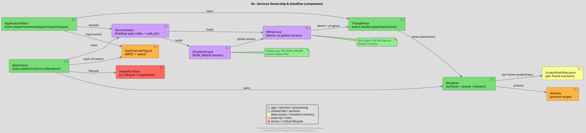

# PPR Game Engine

[](https://github.com/poppolopoppo/ppr/actions/workflows/ci.yml) [](https://github.com/poppolopoppo/ppr/blob/main/LICENSE) [](https://cmake.org/) [](https://en.cppreference.com/w/cpp) [](#features)

A real-time C++23 game engine built with C++20 modules. Eight libraries, one demo, no game yet.

`Architecture · Build · Demo · Tests · Status · Docs`

## Purpose

PPR exists to answer a concrete question: what does a from-scratch engine look like when it uses modern C++ throughout — modules instead of headers, ownership visible in the type system, errors returned as values instead of thrown or hidden? The engine is the product. The demo application is the reference client that exercises it, the way samples serve for sokol or Diligent: proof the engine runs real frames on real machines.

What PPR is not: not a game, not an editor, not a framework with shipped titles behind it. There is no gameplay code in this repo.

## Platform support

| Platform | Compiler presets | CI |
|---|---|---|
| Windows | `msvc-dev`, `msvc-live`, `msvc-rel`, `clang-cl-dev`, `clang-cl-rel` | `windows-msvc-dev` |
| Linux | `clang-dev`, `clang-rel` | `linux-clang-dev` (Xvfb + Mesa) |
| macOS | `clang-dev`, `clang-rel` | — |

GPU backends go through a single abstraction over Slang-RHI (D3D12 on Windows, Vulkan elsewhere). The hidden `gcc-*` presets do not support C++ modules and are not usable builds.

## Features

- C++20 modules throughout; one public header (`Macros.h`), everything else imported
- Tiered memory management: OS page allocation, page pools, arenas with watermark restore, composable pool/fallback allocators, PMR/STL adapters
- Non-owning lifetime-checked pointers in debug builds that compile to raw pointers in release
- Lock-free message channel, compile-time event multiplexing, structured cancellation for async work
- Platform layer with Windows, Linux, macOS, and stub backends: memory, timers, processes, file watching, async I/O
- Slang shaders compiled at startup; one GPU abstraction for devices, buffers, and command lists
- Content-free renderer: it owns frame orchestration and presentation only; each render pass owns its own pipelines and GPU caches and draws from an immutable per-frame camera snapshot
- Recoverable failures returned as `std::error_code` / `std::expected`, consistently; teardown releases in reverse and keeps the first error
- Four test suites wired into CTest, running on CI

## Build

Prerequisites: CMake 4.3+, Ninja, Vulkan SDK, Git, and a C++23 toolchain — VS 18 Insiders (MSVC 14.51) required for `import std` / `CXX_MODULE_STD` on Windows, Clang 18+ elsewhere. First configure needs network access (dependencies are fetched via vcpkg and CPM).

```bash
git clone https://github.com/poppolopoppo/ppr.git
cd ppr
```

Windows builds run in one long-lived `vcvars64` shell: pay vcvars once, then configure, build, and test inside that same shell for the whole session.

```bat
REM Windows - VS 18 Insiders vcvars, paid once per shell/session
call "C:\Program Files\Microsoft Visual Studio\18\Insiders\VC\Auxiliary\Build\vcvars64.bat"

REM Configure (or choose clang-cl-dev instead on Windows)
cmake --preset msvc-dev
REM Build
cmake --build out/build/msvc-dev --parallel
REM Run the four test suites
ctest --test-dir out/build/msvc-dev --output-on-failure
```

A shell that skips the Insiders `vcvars64.bat` now fails fast in the MSVC pre-project guard instead of configuring; repeat the `call` in every new shell. (Before the guard, this silently resolved VS 2022 Community 14.44 plus a bad vcpkg toolchain path and yielded an unusable build tree.) On Linux/macOS, skip the `call` and use the `clang-*` presets.

For MSVC-only presets, first configure pins `cl`, `link`, and `lib`, but vcvars alone cannot undo LLVM-MinGW `ld`/`ar` selected by an inherited `PATH` or cached CMake values. Check `CMAKE_CXX_COMPILER`, `CMAKE_LINKER`, and `CMAKE_AR` in `out/build/msvc-dev/CMakeCache.txt` and the generated archive rule for MSVC tools. Vcpkg detects its compiler separately and can pick installed VS 2022 even when CMake uses VS 18; MSVC-only presets set `VCPKG_VISUAL_STUDIO_PATH` from the active `VSINSTALLDIR` for initial configure. Ninja auto-regeneration during a separate `cmake --build` omits preset environment; vcvars supplies `VSINSTALLDIR` but not `VCPKG_VISUAL_STUDIO_PATH`, so the helper restores its normalized value from `VSINSTALLDIR` when the override is absent. Vcpkg rejected `.../18/Insiders/` despite detecting `.../18/Insiders`. On the first fresh configure, check vcpkg's `Compiler found:` output points to VS 18. If an existing `msvc-dev` tree is contaminated, run `cmake --fresh --preset msvc-dev` once in that same VS 18 Insiders vcvars shell and recheck. Otherwise use normal `cmake --preset msvc-dev`; source-refactor compilation errors are a separate issue.

`msvc-dev` is the daily preset. `msvc-live` is the Edit & Continue preset. `msvc-rel` is the optimized build (tests off, stripped PDB alongside the full one). The `*-dev` presets configure with developer mode (warnings as errors and sanitizers). There are no build or test presets — build and test paths are passed explicitly.

## Demo

`game/main.cpp` defines the demo application. On startup it loads 16 glTF models, decodes their textures to RGBA8, and uploads them to the GPU; if nothing loads, startup fails with a filesystem error rather than an empty window. Every frame it re-submits a static 53-piece cutaway habitat (~20 units wide, five zones) through the renderer and presents it in a 1280×720 vsync'd window with a free camera. The window title shows per-frame CPU time (`"<name> - CPU = <ms> ms"`); one submission summary is logged once, not per frame. Shutdown releases GPU resources in reverse order.

```bash
cmake --build out/build/msvc-dev --parallel
out/build/msvc-dev/game/app.game   # .exe on Windows; shaders, textures, meshes are staged beside it
```

The whole scene draws through a single Slang shader program (`assets/shaders/mesh_bindless.slang`). That is deliberate: one direct draw path, currently no indirect lanes.



Startup, frame loop, and shutdown follow the same shape every run — initialize services, load and upload the scene, re-submit each frame, release everything in reverse on the way out:



## Tests

```bash
ctest --test-dir out/build/msvc-dev --output-on-failure
```

| Suite | What it covers | Needs a window |
|---|---|---|
| `EngineCoreUnitTests` | Memory, containers, concurrency, I/O | No |
| `EngineSimUnitTests` | Chunk grid, fixed-timestep tick, snapshots | No |
| `EngineAppUnitTests` | Platform-dependent behavior | Yes (GLFW) |
| `EngineAssetUnitTests` | Image decode, mesh import, GPU caches, render gate | Headless GPU tiers |



## Architecture

```
game/main.cpp → engine.app → engine.core / engine.math / engine.shader /
                                engine.rhi / engine.image / engine.mesh
                  engine.rhi   → engine.core / engine.math / engine.shader
                  engine.sim   → engine.core / engine.math
                  engine.shader → engine.core
                  engine.math   → engine.core
                  engine.image  → engine.core / engine.math
                  engine.mesh   → engine.core / engine.math
```

One rule: dependencies point down. Nothing below the application layer knows about windows, cameras, or game objects. The shape of every program using the engine is the same:

```cpp
demo::TurboLarbin app("ppr", argv_span);
const std::error_code err = app.run();
return err.value();
```



Ownership follows the same shape. The application owns the platform, the services, and the renderer; the editor layer owns the scene, the camera, and the render passes; the renderer itself only presents what it is given:



| Directory | Responsibility |
|---|---|
| `game/` | Demo entry point and scene |
| `assets/` | Shaders, textures, meshes staged next to the executable |
| `lib/engine/core/` | Types, allocators, containers, concurrency, I/O, platform layer |
| `lib/engine/math/` | Vector / matrix / quaternion math |
| `lib/engine/image/` | CPU image decoding (PNG, JPG, KTX2, DDS) |
| `lib/engine/mesh/` | CPU mesh import (glTF / GLB) |
| `lib/engine/shader/` | Slang shader compilation service |
| `lib/engine/rhi/` | GPU abstraction (devices, buffers, command lists) |
| `lib/engine/sim/` | Deterministic simulation: chunk grid, fixed-timestep tick, snapshot |
| `lib/engine/app/` | Application lifecycle, window, input, scene, UI, renderer |
| `lib/engine/tests/` | Test suites plus the shared harness |
| `cmake/` | Presets, toolchain flags, dependency resolution |
| `include/pP/` | The single public header |

## Status

What the demo exercises today vs. what is still ahead. No dates; the checked items have tests behind them.

- [x] Allocators, containers, concurrency primitives, async I/O
- [x] Platform layer on Windows / Linux / macOS (+ stub)
- [x] Image decode and mesh import on the CPU
- [x] Shader compilation at startup, GPU abstraction over D3D12 / Vulkan
- [x] Renderer with pass-owned resources, immutable camera snapshots
- [x] Demo scene loading, submitting, presenting, and tearing down cleanly
- [ ] Frame pacing from platform timers with per-stage diagnostics
- [ ] Dedicated render thread
- [ ] Deterministic fixed-timestep simulation substrate
- [ ] Asset content pipeline (cooked packages)
- [ ] Shading: PBR-style materials, global illumination, temporal upscaling, post-processing
- [ ] Editor tooling beyond the debug overlay (picking, gizmos, asset browser)

## Troubleshooting

- `gcc-*` presets fail on modules. They are hidden for a reason; use MSVC or Clang presets.
- Configure fails looking for Ninja. Module builds require it; install Ninja and re-configure.
- First configure fails on dependencies. It needs network for vcpkg/CPM fetches (CI clones vcpkg itself); `VCPKG_ROOT` is optional if you already have one.
- "Where is the exe?" It lands in `out/build/<preset>/game/`, not `out/build/<preset>/`. DLLs and asset directories are copied beside it by post-build steps.
- Demo exits at startup with a filesystem error. It found no loadable models under the staged `meshes/` directory — check the log lines for which assets failed and why.

## Docs

- [codemap.md](codemap.md) — navigable repository map; start here for any area of the code
- [AGENTS.md](AGENTS.md) — engineering contract and conventions (required reading before large changes)
- `docs/diagrams/` — rendered architecture diagrams
- `docs/plans/` — design notes; these describe intent, not implemented code

## Contributing

Focused changes, tests for behavior changes, a clean developer-mode build. See [AGENTS.md](AGENTS.md) before anything structural.

## License

MIT — see [LICENSE](LICENSE).
